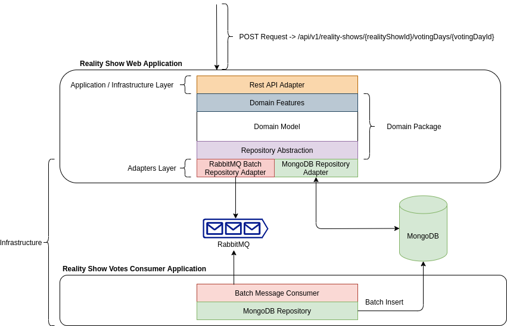

> ### Reality Show Example Application
This repository was created to present an architectural proposal for a reality-show application.

## How it works



## Application stack:

#### domain:
* Java 11
* Project Reactor
* Javax Validation
* Javax Inject
* Project Lombok
#### realityshowweb:
* Java 11
* Spring Boot
* Spring WebFlux
* Spring Data MongoDB Reactive
* Testcontainers
#### realityshowvotes:
* Java 11
* Spring Boot
* Spring Data MongoDB
* Testcontainers


#### Load Tests
The directory called "integrated-tests" is a maven project that uses Testcontainers to run the entire 
environment and perform a relatively high load of requests for the application.

There is a utility script to run the existing tests:
```shell
./run_tests.sh
```

